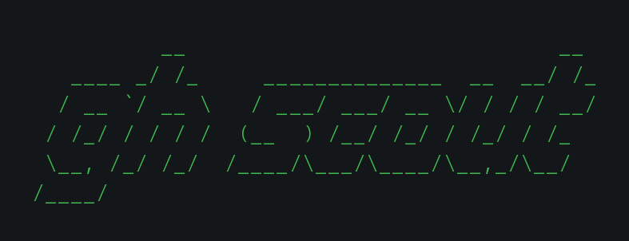
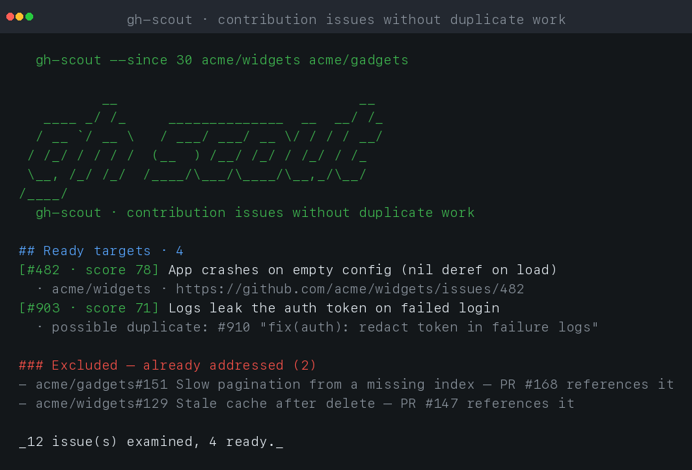
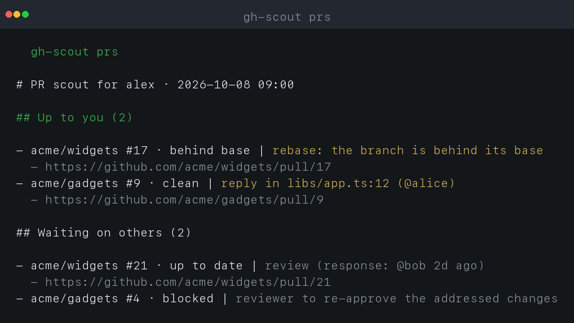

# gh-scout



**Find contribution-worthy GitHub issues, triage your own pull requests, and
count your merge history - one read-only binary.**

`gh-scout` does three jobs:
- picks contribution-worthy **issues** without duplicating in-progress work,
- tells you, for each of **your open pull requests**, who owes the next move,
- counts how many pull requests you've **merged** per repository.

[](https://go.dev)
[](https://github.com/andyst-dev/gh-scout/actions)
[](https://golangci-lint.run)
[](#license)

---

## Why

Picking a "good first issue" is easy. Picking a *good first issue that isn't
already being fixed by someone else* is the part that wastes contributors'
time. A pull request that `Fixes #123` makes issue #123 a trap: you start it,
then someone closes it as a duplicate.

That trap is exactly what `gh-scout` removes. It never posts anything; it
only tells you, for each issue, whether an open PR already covers it and how
much signal the issue gives to start work on it.

```
$ gh-scout --since 30 acme/widgets acme/gadgets
...
## Ready targets · 4
- **[#482 · score 78 · easy]** App crashes on empty config (nil deref on load)
  - suggested PR: fix the null path: add a regression test, then the patch
  - possible duplicate: #910 "fix(auth): redact token in failure logs"
...
### Excluded (2 already addressed)
- acme/gadgets#151 Slow pagination from a missing index (open PR #168 already references it)
```

```
$ gh-scout --since 30 acme/widgets acme/gadgets
```
The brand header (the banner shown at the top of this page) is drawn on
*stderr* and only when the output isn't JSON, so reports stay clean when piped
into a file or another tool.

## Screenshots

A full scouting run against two example repositories:



Each target carries a **`score` (0-100)**: how fixable the issue looks, from
its title, body and labels. The exact weighting is tabled under
[How it decides](#how-it-decides).

## Install

```sh
go install github.com/andyst-dev/gh-scout/cmd/gh-scout@latest
```

No external dependencies; the standard library is all it needs.

## Authentication

`gh-scout` is **read-only** and never posts anything, so it only needs to
*read* issues and pull requests - a read-only token is enough.

The token comes from `--token` when given, otherwise from the **`GITHUB_TOKEN`**
environment variable:

```sh
export GITHUB_TOKEN=...        # both commands then use it
```

- The **issue scout** (`gh-scout owner/repo`) works without a token, but the
  anonymous quota (60 req/h) runs out after one or two repositories; a token
  raises it to 5000 req/h.
- The **PR scout** (`gh-scout prs`) **requires** a token even with `--user`:
  its verdict reads GitHub's GraphQL (`reviewDecision` and review threads), and
  the author is auto-detected from the authenticated user.

No token handy? If the GitHub CLI is logged in, reuse its:

```sh
export GITHUB_TOKEN=$(gh auth token)
```

Otherwise create a fine-grained personal access token with *read* access to
Issues and Pull requests (a classic `repo` or `public_repo` token also works).

## Usage

**Commands at a glance.**

| Command | What it does |
|---|---|
| `gh-scout owner/repo [...]` | picks contribution-worthy **issues** |
| `gh-scout prs` | triages your open **pull requests** (`Up to you` vs `Waiting on others`) |
| `gh-scout history [repo ...]` | counts your **merged** pulls per repository |
| `gh-scout rules-template` | prints the default scoring rules to edit |

### Issue scout

```sh
gh-scout [flags] owner/repo [owner/repo ...]
```

The GitHub token is read from `--token` or `GITHUB_TOKEN` - see
[Authentication](#authentication). Anonymous use works but rate-limits quickly.
Run `gh-scout --help` for the live flag reference.

| Flag | Default | Meaning |
|---|---|---|
| `--since` | `14` | only issues created within this many days (`0` disables) |
| `--labels` | | comma-separated labels to keep, e.g. `bug,help wanted` |
| `--max` | `50` | max issues examined per repository |
| `--min-score` | `0` | drop targets scoring below this |
| `--format` | `markdown` | `markdown` or `json` |
| `--rules-file` | | JSON file overriding scoring weights |
| `--version` | | print version and exit |

Examples:

```sh
# A weekly pick list for two repos, Markdown
gh-scout --since 30 --labels bug,help wanted acme/widgets acme/gadgets

# Machine-readable output for another tool
gh-scout --format json --min-score 60 acme/widgets
```

### Tuning the rules

Every scoring weight and the `ready` threshold are configurable without
recompiling. Generate a copy of the current defaults, then edit it:

```sh
gh-scout rules-template > rules.json
```

The file is plain JSON: a field you leave out keeps its default, so you can
change a single weight and leave the rest untouched. Every field is explained in
the [Rules reference](#rules-reference) below. For example, an `issue` project
that wants only well-described defects might raise the bar:

```json
{
  "ready_threshold": 50,
  "weights": {
    "title_defect": 40,
    "body_reproduction": 30
  }
}
```

```sh
gh-scout --rules-file rules.json acme/widgets
```

Valid thresholds are 0-100. `--min-score` still applies on top of the rules'
ready threshold.

### Rules reference

A rules file holds two things: the `ready` threshold and the point deltas
behind the fixability score.

| Field | Meaning | Default |
|---|---|---|
| `ready_threshold` | minimum score for an issue to be `ready`; below it the issue is `unclear` and skipped | `35` |
| `weights.title_defect` | bonus when the title names a concrete defect | `25` |
| `weights.body_reproduction` | bonus when the body has a reproduction or code sample | `20` |
| `weights.mentions_tests` | bonus when the body mentions tests or expected behaviour | `15` |
| `weights.bug_label` | bonus when labelled `bug` | `15` |
| `weights.good_first_issue` | bonus when labelled `good first issue` / `good-first-issue` | `20` |
| `weights.help_wanted` | bonus when labelled `help wanted` / `help-wanted` | `10` |
| `weights.body_substantial` | bonus when a long body (60+ chars) describes the problem with no reproduction | `10` |
| `weights.title_question` | penalty when the title is a question, not a defect | `-20` |
| `weights.body_empty` | penalty when the body is empty or very thin (< 40 chars) | `-15` |
| `weights.feature_request` | penalty when the issue looks like a feature request | `-25` |
| `weights.title_generic` | penalty for a vague title (`bug`, `issue`, `problem`...) | `-10` |

## PR scout

`gh-scout prs` reports on **your own** open pull requests: for each one it says
whether a maintainer or other person has responded since your last activity,
whether the branch is up to date with its base, and - the headline - who owes
the next move (`Up to you` vs `Waiting on others`). It never posts anything; like
the issue scout it is read-only. The verdict reads GitHub's GraphQL
`reviewDecision` and open review threads, so `prs` needs a token even when
`--user` is passed (see [Authentication](#authentication)).

```sh
gh-scout prs [flags]
```

When no `--user` is given, the author is auto-detected from the authenticated
GitHub user (which needs a token). Anonymous use of `prs` therefore requires
`--user`.

| Flag | Default | Meaning |
|---|---|---|
| `--user` | | PR author to scout (auto-detected from the token if empty) |
| `--repos` | | comma-separated `owner/name` filter |
| `--days` | `0` | drop PRs not updated within this many days (0 disables) |
| `--max` | `0` | total pull requests examined (0 disables) |
| `--format` | `markdown` | `markdown` or `json` |
| `--delta` | | compare with the previous `--delta` run and show only what changed |
| `--token` | | GitHub token (defaults to `GITHUB_TOKEN`) |
| `--version` | | print version and exit |

**The response rule**: a response exists iff there is at least one comment or
review by someone other than you, made after *your own most recent activity*
(the later of your last push and your last comment or review). If you already
replied after their comment, nothing on that thread is pending. The report
shows the *newest* such response.

**Action - who owes the next move** (`Up to you` / `Waiting on others`).
A verdict from three signals GitHub already computes - no guesses:

- the branch **conflicts** or is **behind** its base -> you rebase;
- an **open review thread** whose newest comment is someone else's and is newer
  than your last activity -> reply in that thread (the anchor is named, e.g.
  `reply in libs/app.ts:12 (@alice)`);
- `reviewDecision` is `CHANGES_REQUESTED` **while the change is still open** -
  an outstanding review thread, or a freshly-requested change you have not
  acted on (the requesting review is newer than your last activity).

Everything else is `Waiting on others`: reviewers, required checks, or a pending
merge. A pull request can carry a conflict *and* a requested change; reasons
are listed in that priority order. GitHub only marks a thread *resolved* when
someone clicks Resolve, so a thread you handled but never resolved can
(correctly) keep `reviewDecision` at `CHANGES_REQUESTED` and keep the PR under
"Up to you" until you resolve it - the scout tells you to resolve those threads.
Once every thread is resolved and the requesting review predates your last
activity, the changes are addressed and the PR moves to `Waiting on others`: it only
awaits the reviewer's re-approval.

**PR status** (derived from GitHub's merge state), each with what it means for you:

| Status | Meaning | What to do |
|---|---|---|
| `up to date` | mergeable and `mergeable_state` is `clean` | nothing, it can merge |
| `behind base` | the branch is behind its base branch | rebase onto the base |
| `conflicts` | the branch conflicts with its base | rebase and resolve the conflicts |
| `blocked` | mergeable but a required check or review is still pending | respond to the outstanding review / wait for the bot and CI to pass |
| `unstable` | mergeable but some status checks are failing | look at the failing checks |
| `evaluating` | GitHub has not computed a mergeable verdict yet | check again shortly |

**Superseded hint.** Before a rebase, the scout checks a conflicting pull
request against its base for the "already landed" shape, and adds an advisory
`may be superseded: ...` line under it when either holds:

- a file the pull request **modifies no longer exists on the base** - the base
  renamed or removed it, so the change may have been re-homed or merged there;
- every line the pull request **adds already exists in that file on the base** -
  the change is already merged.

It is a hint, not a verdict: it explains why a rebase may be wasted, so read the
base before starting. API errors stay silent, so it never cries wolf.

**No silent truncation.** By default nothing is hidden: every open pull request
is reported (`--days` and `--max` are off at `0`). Narrow a run with those flags
and the report ends with a line saying how many were hidden and why (`N open pull
request(s) not shown (X older than --days, Y beyond --max)`), so a short list is
never mistaken for the whole set. The same counts are on the JSON output as
`hidden_by_days` and `hidden_by_max`.

**Delta (`--delta`).** Each `--delta` run saves a snapshot
(`~/.cache/gh-scout/state.json`) and, on the next one, reports only what changed:
a new pull request, one that became `up to you` (or went back to waiting on
others), a newer response, a status move, and anything that left the open list -
confirmed as merged or closed through the API rather than assumed. The first
`--delta` has nothing to compare, so it prints the full report and saves the
snapshot; only `--delta` runs save it. This is the cheap repeated check: three
lines that moved instead of the whole list.

Use the same filters (or none) from one `--delta` to the next: the snapshot
records exactly what the last `--delta` scanned, so narrowing a run with
`--repos`, `--days` or `--max` makes a later wider run report the rest as new.

A sample run:



The same branding rule applies: the banner and a legend go to *stderr*, only
when the output is not JSON and the terminal is interactive.

## History (`gh-scout history`)

The long-run counterpart to `prs`: how many pull requests an author has merged
per repository (all time, via the search total). One request per repository,
no paging:

```
$ gh-scout history chrisbenincasa/tunarr kodustech/kodus-ai superset-sh/superset
# Merged by andy

- chrisbenincasa/tunarr · 15
- kodustech/kodus-ai · 12
- superset-sh/superset · 4

Total: 31
```

With no repositories, `gh-scout history` enumerates the author's merged PRs
across **all** repositories and aggregates by repo, highest count first - the
"everything" view in one command.

| Flag | Default | Meaning |
|---|---|---|
| `--user` | | PR author to count (auto-detected from the token if empty) |
| `--format` | `markdown` | `markdown` or `json` |
| `--token` | | GitHub token (defaults to `GITHUB_TOKEN`) |
| `--version` | | print version and exit |

`--format json` prints a machine-readable `{author, repos:[{repo, merged}], total}`.

## How it decides

Each issue becomes a **candidate** with one of three statuses:

- **`ready`**: no open PR references it and it scored at least the threshold
  (>= 35 in the default ruleset) to start work.
- **`addressed`**: an open pull request at least mentions the issue
  (`Fixes #9`, `Closes #4`, or any `#N` in its body). Deliberately broad: a PR
  that links an issue is signalling that issue is being worked on.
- **`merged`**: a recent merged pull request referenced the issue - the fix
  shipped, the issue was just never closed. Same exclusion as `addressed`,
  shown as "merged PR #N already implemented it".
- **`unclear`**: too little to judge; skipped from the ready set.

The **fixability score (0-100)** is a sum of fixed point deltas, purely
declarative rules, nothing inferred. The exact weighting lives in
[`internal/scout/score.go`](internal/scout/score.go):

| Signal | Points |
|---|---|
| title names a defect (`crash` `panic` `leak` `null` `broken` `deadlock` ...) | **+25** |
| body has a reproduction or code sample | **+20** |
| body describes the problem (>= 60 chars) | **+10** |
| mentions tests / expected behaviour | **+15** |
| label `good first issue` | **+20** |
| label `help wanted` | **+10** |
| label `bug` | **+15** |
| title is vague (`bug` `issue` `problem` ...) | **-10** |
| title is a question | **-20** |
| empty / very thin body (< 40 chars) | **-15** |
| `feature` / `enhancement` / `request` label | **-25** |

The total is clamped to **0-100**. A candidate becomes **`ready`** only at
**>= 35** (`--min-score` raises the bar further); below that it is `unclear` and
skipped.

**Difficulty** (`easy` / `medium` / `hard`), decided in `advice.go`:

| Difficulty | They get it when |
|---|---|
| `easy` | label `good first issue` / `help wanted`, or a typo-flavoured title, or the body reproduces *and* mentions tests |
| `hard` | `feature`/`enhancement` label, an architectural title (`refactor` `redesign` `support`), or a long body with no reproduction |
| `medium` | everything else |

Each ready target also carries a one-line **suggested PR** hint picked from the
same signals (e.g. *"fix the crash path: add a regression test, then the
patch"*). It is a heuristic aid; still read the issue before starting.

**Worked example**: *"App crashes on startup with null pointer"*, body with a
`Steps to reproduce` block and `expected: no panic`, labelled `good first issue`:

| Signal | Points |
|---|---|
| title names a defect (`crash`) | +25 |
| body reproduces the problem | +20 |
| mentions tests / expected behaviour | +15 |
| label `good first issue` | +20 |
| **total** | **80** |

80 >= 35 -> **`ready`**; no open PR references it -> offered, difficulty `easy`,
suggested PR *"fix the crash path: add a regression test, then the patch"*
(the `crash` defect word in the title gives this the priority over the generic
repro suggestion).
An issue with none of those signals scores 0 and is **`unclear`**: it never
appears in the ready list.

A *possible duplicate* is flagged, but not excluded, when an open PR has a
similar title without an explicit issue link.

### Limitations

- The score is **heuristic**, not a verdict. `ready` means "looks worth a
  read", never "merge this". Open the issue and judge before starting.
- An issue never reads as `ready` when an **open** pull request references it
  or a **recent merged** pull request already implemented it. A fix landed long
  ago (older than the 200 recent closed pull requests scanned) or through a
  direct commit with no pull request is still missed.
- Only issues are scanned from the repository's first four result pages, so
  the very oldest issues may be out of reach on huge repos.
- With no `GITHUB_TOKEN`, the anonymous quota (60 req/h) is spent in a couple
  of multi-repo runs.

## Project layout

```
cmd/gh-scout/     CLI entry point: issue scout (default), `prs`, `history`, `rules-template`
internal/github/  minimal REST client (tokened, paginated)
internal/scout/   orchestration, anti-duplicate matching, scoring
internal/prs/     pull-request scout: response detection, status, review-verdict action, renderers
internal/history/ merged-pull counts per repository
internal/state/   atomic `--delta` snapshot
internal/report/  Markdown + JSON renderers (shared format kinds)
```

`scout` depends only on an `IssueLister` interface, so the whole decision
layer is unit-tested against a fake (no HTTP mocking).

## Development

```sh
make test        # go test ./...
make lint        # golangci-lint run ./...
make fmt-check   # gofmt cleanliness gate
make build       # build bin/gh-scout
```

## License

[MIT](LICENSE)